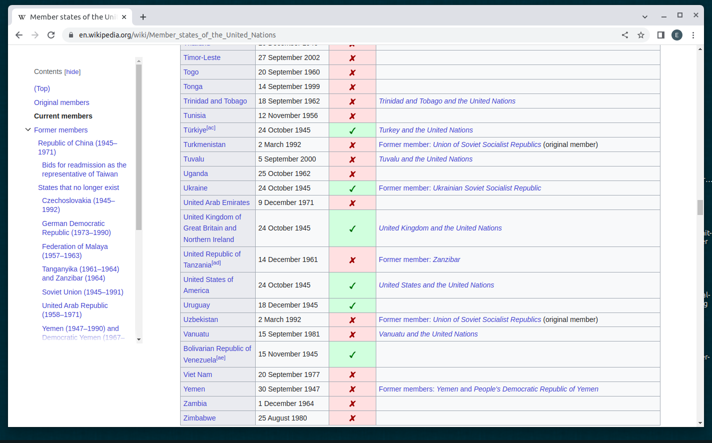
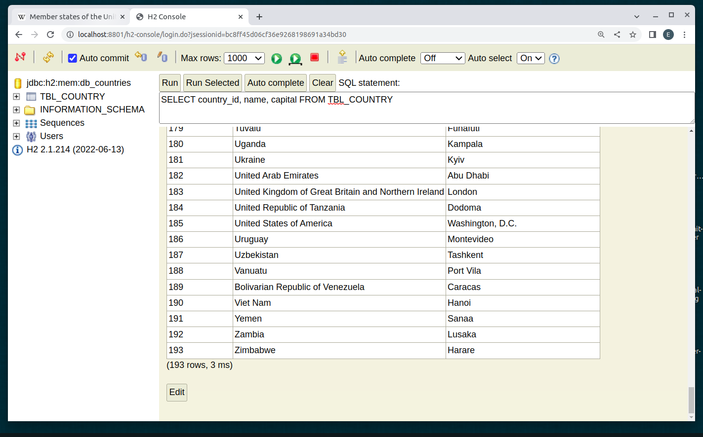

SCRAPING DATA USING JSOUP LIBRARY
---------------------------------------------------------------------------

Application the retrieves info about countries by scraping data from Wikipedia.

---------------------------------------------------------------------------

Jsoup maven dependency added in pom.xml file:

```
    <dependency>
        <groupId>org.jsoup</groupId>
        <artifactId>jsoup</artifactId>
        <version>1.10.2</version>
    </dependency>
```

---------------------------------------------------------------------------

A list with country members of United Nations is retrieved from this URL:

```
https://en.wikipedia.org/wiki/Member_states_of_the_United_Nations

```

In the previous URL there is a list with 193 countries:




---------------------------------------------------------------------------

Once the application runs, the list of countries is retrieved and stored
in an H2 database:



---------------------------------------------------------------------------